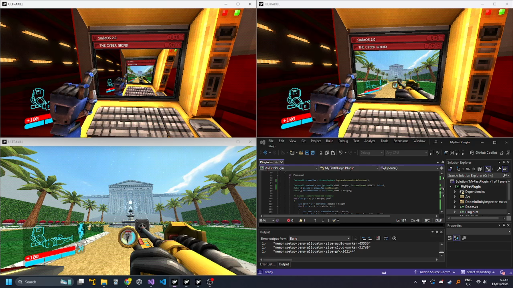

For this to work there are 3 instances of the game open at all times.  MemoryMappedFiles are used to send screenshots between instances every frame which are then rendered on the terminals.  The I/O keys let me change which instance I am currently controlling!

